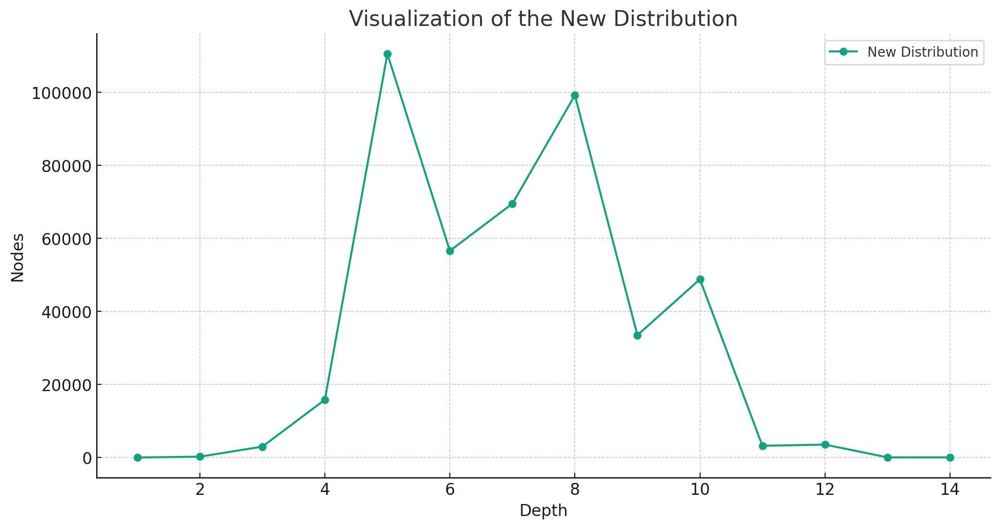

- added check extension again as well as config to deactivate it

- in first test no extreme explosion

- adding alpha beta pruning to quiescence and testing

- removed some unneccessary parameters from the old version

st.fish lv4: Points: 2, Win: 1, Draw: 0, Loss: 1
V14fix: Points: 2, Win: 1, Draw: 0, Loss: 1

win against stockfish probably due to some explosions and long thinking like:

I have now added delta pruning to quiescence search. I am not certain but optimistic that I have understood delta pruning. Anyways it works in reducing the evaluated nodes. Just hope it doesn't skip moves we actually needed. the safety margin for delta pruning is currently 100

I have now added a safety margin to delta pruning

275 moves:[[-1.797693134862315e+308, 0, 0, 0, 0, -10.1, 'e2b2'], [-5.99231044954105e+307, 0, 0, 0, 0, -10.13, 'e2c2', -10.34, 'b1c1', -10.43, 'c3b3']]
[-0.03, -0.03, -0.18, -0.15, -0.41, -0.61, -0.81, -1.08, -0.34, 2.69, 5.56, 5.82, 5.73, 5.56, 5.56, 4.7, 5.86, -0.0, 0.17, 0.22, 0.23, 0.28, 0.14, 0.32, 0.61, 0.45, 0.0, 0.21, -0.09, -0.45, -0.56, -0.68, -0.34, 1.8, -0.69, -0.36, -0.15, -0.42, -0.34, -0.32, -0.35, -0.59, -0.49, -0.7, -0.59, -0.44, -0.4, 0.06, -0.4, -0.08, 0.33, 0.58, 0.44, 0.29, 0.28, 0.83, -2.89, -2.71, 2.05, 2.79, 2.73, 2.74, 2.24, 2.59, 2.5, 2.48, 2.14, 2.22, 2.88, 2.4, 2.11, 2.14, 2.16, 2.36, 2.42, 2.44, 2.36, 2.54, 4.28, 5.12, 4.93, 2.85, 3.34, 3.75, 3.71, 3.37, 3.56, 3.67, 3.8, 3.55, 3.61, 3.23, 3.31, 4.18, 4.25, 4.26, 4.28, 4.36, 4.43, 4.3, 4.04, 4.34, 2.47, 1.72, 1.81, 1.93, 2.29, 2.37, 2.42, 2.63, 1.75, 1.46, -1.73, -1.86, -2.18, -1.85, -2.27, -1.77, -1.88, -2.02, -2.4, -2.01, -2.13, -2.54, -2.18, -2.44, -7.44, -8.02, -8.05, -8.96, -8.3, -9.8, -10.0, -10.28, -10.29, -10.44, -10.69, -10.46]
sum execution time: 2427585, nodes: 13105397