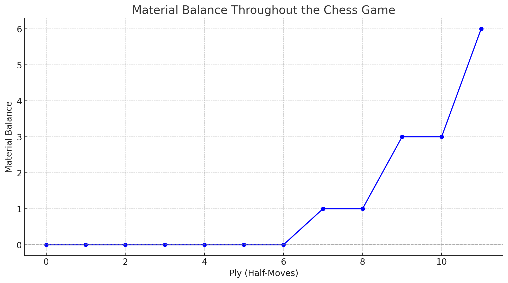
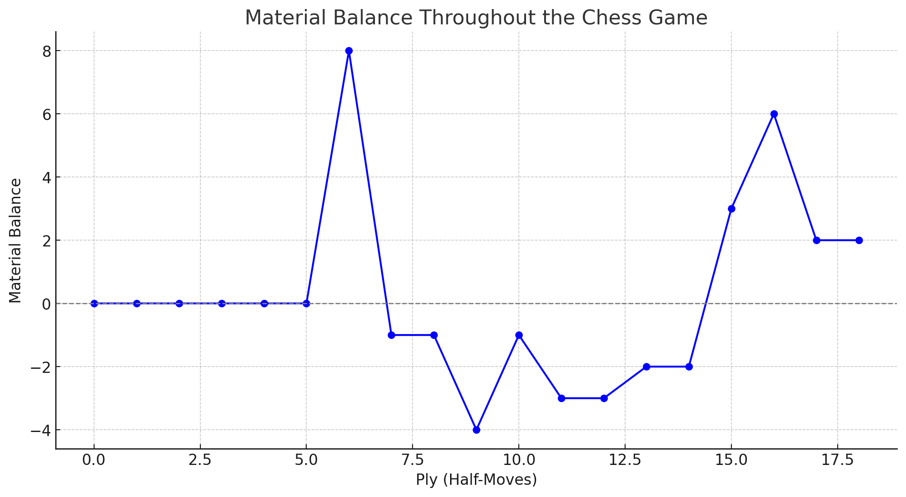
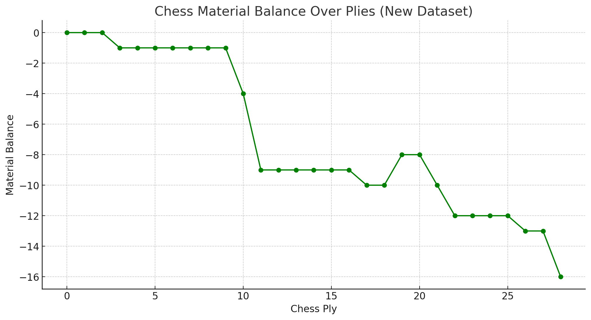
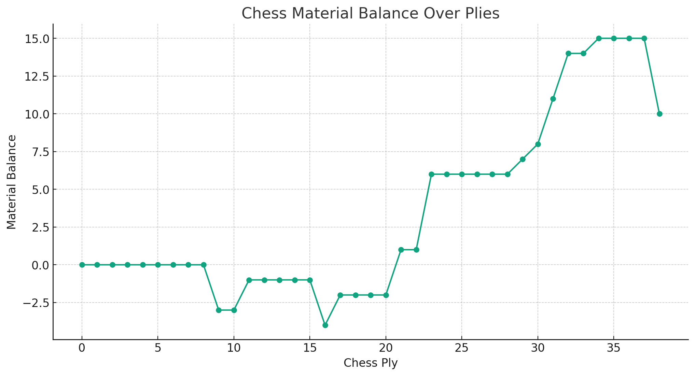
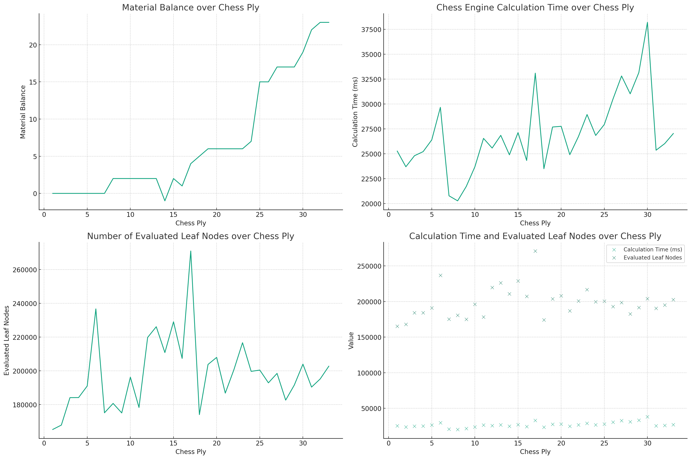

## Tournament Results

#### testing DEGRADATION_IMPACT_RATIO

### Tournament 1
11.2 with 250 or 1000
- AI V11.1: Points: 2, Wins: 1, Draws: 0, Losses: 1
- AI V11.2: Points: 2, Wins: 1, Draws: 0, Losses: 1

### Tournament 2
11.2 with 100
- AI V11.1: Points: 2, Wins: 1, Draws: 0, Losses: 1
- AI V11.2: Points: 2, Wins: 1, Draws: 0, Losses: 1

### Tournament 3

11.2 with DEGRADATION_IMPACT_RATIO = 90

- AI V11.2: Points: 4, Wins: 2, Draws: 0, Losses: 0
- AI V11.1: Points: 0, Wins: 0, Draws: 0, Losses: 2

V11.2 wins as black and as white:

 

https://chat.openai.com/share/3f529b0a-e7db-413c-9e2b-aece8677786d

### improved queen move precision

### tournament 4

- AI V11.3: Points: 6, Wins: 3, Draws: 0, Losses: 1
- AI V11.4: Points: 6, Wins: 3, Draws: 0, Losses: 1
- AI V11.2: Points: 0, Wins: 0, Draws: 0, Losses: 4

- AI V11.3 (slow): Points: 6, Wins: 3, Draws: 0, Losses: 1
- AI V11.1: Points: 4, Wins: 2, Draws: 0, Losses: 2
- stockfish lv1: Points: 2, Wins: 1, Draws: 0, Loss: 3

- V11.3: Points: 2, Wins: 1, Draws: 0, Losses: 1
- st.fish lv2: Points: 2, Wins: 1, Draws: 0, Losses: 1

- V11.3: Points: 8, Win: 4, Draw: 0, Loss: 0
- st.fish lv3: Points: 4, Win: 2, Draw: 0, Loss: 2
- V11.4: Points: 0, Win: 0, Draw: 0, Loss: 4

- V11.3bb: Points: 2, Win: 1, Draw: 0, Loss: 1
- st.fish lv4: Points: 2, Win: 1, Draw: 0, Loss: 1

### improved 11.3bb
- V11.3bb: Points: 8, Win: 4, Draw: 0, Loss: 0
- st.fish lv4: Points: 4, Win: 2, Draw: 0, Loss: 2
- V11.1: Points: 0, Win: 0, Draw: 0, Loss: 4
